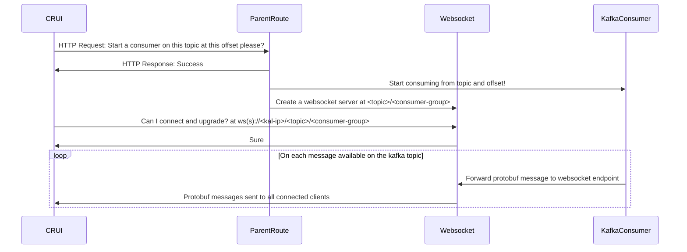
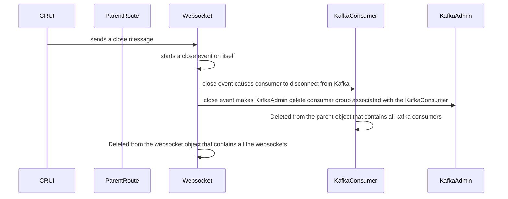
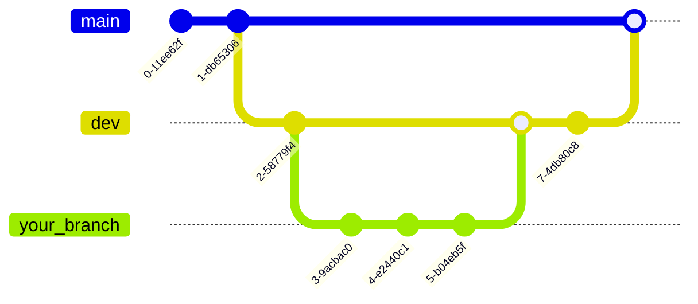

# Kafka Access Layer

## Description

Formerly known as the CRUI consumer websocket forwarder. 
This application's primary purpose is to support the interaction of CRUI users with Kafka. It is a node.js application that should be deployed on VX as a microservice. 

It relies on websockets to form a 'pipe' between the kafka consumer and the CRUI client and this means that pod client affinity is important to the operation of the microservice. Each pod has a state that contains its connection to particular clients.  

## Installation
### Prerequisites 
You will need nodejs installed on your local machine 

### Download and Install 
Clone this git repository locally 
Start a terminal and cd to the directory of this code and run 

```shell 
$ git clone https://gitlab.unclass.factory.subs/vx/applications/crui/kafka-access-layer.git <repo-name> 
$ npm install
``` 

## Usage
Here are the [Autogenerated Docs](docs.md
) generated with documentation.js 

### Locally without Docker 
```shell
$ node kal.js
```
In dev mode, nodemon tracks changes to the source code and restarts the microservice every time the source code changes

```shell
$ npx nodemon kal.js 
```

### Locally with Docker 
TODO 

## Concepts
### [config](config/) 
The config folder dictates the configuration of the microservice, when running locally or on cluster 

### [startup](startup/)
This folder contains files that contain interactions with other elements of the VX system that the application. 

### [middleware](middleware/) 
This empty folder is a placeholder for middleware we look to apply. This could be rate limiting requests from particular users in future for example.

### [Protos](protos/) 
This folder contains the protobuf that the microservice needs to decode the messages 

### [routes](routes/)
This folder contains the static routes that the microservice maintains permanently 

### [kafka-websocket](kafka-websocket/)
This folder contains the logic for the kafka-websocket pipe that forwards kafka topic data from a consumer to a websocket endpoint.

## System Diagrams 

### Starting forwarding from topic to websocket 


### Finish Consumption of a topic 


## Static Routes 
Below the static routes that are permanently available to applications using the kafka access layer 

### [control](routes/controlRoute.js)
#### Sample Request 
TODO is there a control protobuf message? 
#### Sample Response 
TODO 

### [/wsparent](routes/wsParentRoute.js)

#### /start
##### Sample Request 
```json
{
    "topic": "<topicName>", 
    "consumerGroup": "<consumerGroup>",
    "timestamp": "<timestamp>", 
}
```

##### Sample Response
```json
{
    "status" : "success"
}
```


### [Topics Routes](routes/topicsRoute.js) /topics
These are static routes to retrieve the whole list of topics 

#### /topics/list 
#### Sample Request 
Empty GET request 

#### Sample Response
```json 
    {
        "availableTopics": ["<topic1>", "<topic2>"] //an array of the topics that exist on kafka 
    }
```


## Dynamic Routes
Below is a template for interacting with dynamic routes 

#### /topic-name/consumer-group
topic-name and consumer-group are variables that vary with what topic you're trying to listen to and what consumer group the consumer on the kafka access layer is a part of. 

```
http(s)://<kal-ip>/<msg.topic>/<msg.consumerGroup>
``` 
Where msg reflects the fields in the Sample Request for the websocket parent route 

##### JavaScript Client Connection Example 
```js
    ws = new WebSocket(url) //url iis the full URL of the above route. 
    ws.binaryType = "arraybuffer"
    
    ws.onopen = ()=>{ 
        // what to do when the websocket connection is opened
    }
    ws.onmessage = (event) => { 
        event.data // is the protobuf encoded value that needs decoding 
        //what to do on receipt of each message
    }
    ws.onclose = ()=>{
        // what to do when the websocket connection is closed
    }
```

##### Sample JavaScript for Websocket and Kafka Consumer deletion 

```js 
ws.send("close")
```

## Support
hector.vansmirren@baesystems.com 
daniel.kerry@baesystems.com 

## Roadmap
```mermaid
gantt 
```

## TODOs 

- [ ] Add in express-validator to requests 
- [ ] Add in express-async-handler for better error handling 
- [ ] turn this API into an oAuth 2.0 compliant API 
    - [ ] Make clients supply an API token 
    - [ ] Check this token
- [ ] Test running this locally with docker 
    - [ ] Update the Docs to show how to run this with docker locally 
- [ ] Update the certificates automatically when they expire.


## Contributing
The aim is for this repository is that CRUI is incremented every sprint. 
1. Check main and dev are synchronised as they shoudl be at the start of a sprint. 
    a. If not merge main into dev
2. Create a new branch from dev 
3. Commit your work to your new branch 
4. Lint your code before you merge, applying the following to all your changed files 
    ```sh
    $ .\node_modules\.bin\eslint <exampleFile.js> --fix 
    ```
5. When completed merge back into dev 
6. At the end of the sprint dev will be tested and when passing all tests should be merged into main. 





## Authors and acknowledgment
@hector.vansmirren
@daniel.kerry 


## License
For open source projects, say how it is licensed.

